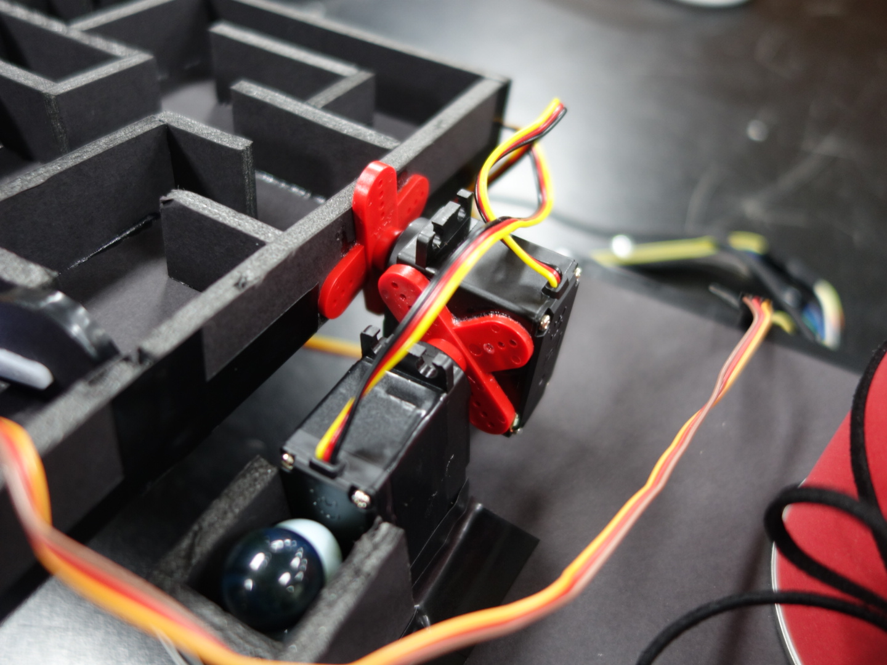
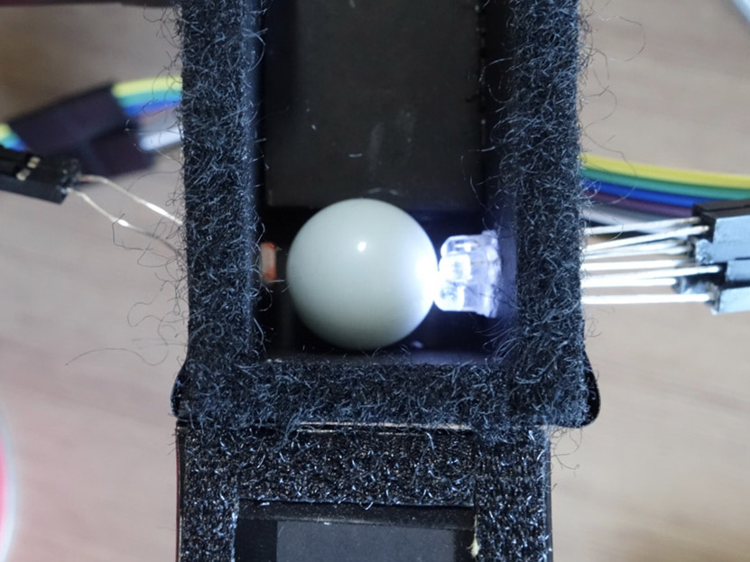

# GyroMaze-STM32
이 프로젝트는 임베디드 실험의 텀 프로젝트 결과물입니다. 궁금하신 사항이 있으면 이슈에 남겨주세요! 질문과 제안은 언제나 환영입니다.

## 개요

모바일 기기로 미로판을 조작하는 간단한 구슬 미로 게임입니다. 

## 실험 환경

### 실험 장비

- STM32(Cortex-M3)
- JTAG(Joint Test Action Group)
- DSTREAM
- Android Device

### 소프트웨어

- Eclipse for DS-5
- Android Studio

## 하드웨어

### 사용 모듈

| Servo Motor 1                     | Servo Motor 2                                                | Light Sensor                                                 | Bluetooth Module                            | LED                                                          |
| --------------------------------- | ------------------------------------------------------------ | ------------------------------------------------------------ | ------------------------------------------- | ------------------------------------------------------------ |
| [1] | [[2]](https://goo.gl/images/vFNxJ6) | [[3]](https://goo.gl/images/EHFuvN) |  | [[4]](https://smartstore.naver.com/young-je/products/253019772) |
| TSR11965                          | TF0006SER                                                    | 광센서 - 포토레지스터(찾는중..)                              | FB755AC                                     | 고휘도 LED전구 3                                             |

### 구성도

(준비중)

### 회로도

### 모듈별 사진

#### 미로판 제어 지점

|                        위에서 본 모습                        |                      대각선에서 본 모습                      |
| :----------------------------------------------------------: | :----------------------------------------------------------: |
|  |  |

#### 게임 시작 지점

|               입구에 설치된 자동문 - 열렸을 때               |               입구에 설치된 자동문 - 닫혔을 때               |
| :----------------------------------------------------------: | :----------------------------------------------------------: |
|  |  |

#### 게임 끝 지점

|              게임 끝 지점 - 구슬이 들어왔을 때               |                게임 끝 지점 - 구슬이 없을 때                 |
| :----------------------------------------------------------: | :----------------------------------------------------------: |
|  |  |

## 소프트웨어

### 소스파일

- [`gyro3.c`](ens7_20/gyro3.c)
- [`bluetooth.h`](ens7_20/bluetooth.h), [`bluetooth.c`](ens7_20/bluetooth.c)
- [`servo.h`](ens7_20/servo.h), [`servo.c`](ens7_20/servo.c)
- [`lightsensor.h`](ens7_20/lightsensor.h), [`lightsensor.c`](ens7_20/lightsensor.c)
- [`queue.h`](ens7_20/queue.h), [`queue.c`](ens7_20/queue.c)

### 게임 로직

(준비중)

## 미로 제작

(준비중)

## 시연

### 연관 프로젝트

- [star51/GyroBT](https://github.com/star51/GyroBT) - STM32를 제어하는데 사용된 블루투스 기반의 안드로이드 프로젝트

### 참여자

- 강주연
- 정성훈
- 허태준
- 곽도영

## 참고

[1] 서보모터 1 사진, 

[2] 서보모터 2 사진, https://goo.gl/images/vFNxJ6

[3] 조도센서 사진, https://goo.gl/images/EHFuvN

[4] LED 사진, https://smartstore.naver.com/young-je/products/253019772